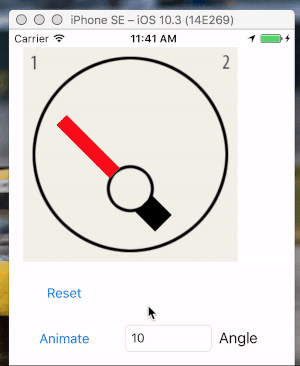

# PAVRoundGauge
UIView simulating an analog gauge such as speedometer, tachometer, fuel gauge, etc.

It supports 3 types of animation: Smooth, Rev-up (which over-rotates at the end then settles back), and Pegged (which moves extremely fast and has a spring to the needle). Also supports offsetting of needed upward or downward from center of view.

